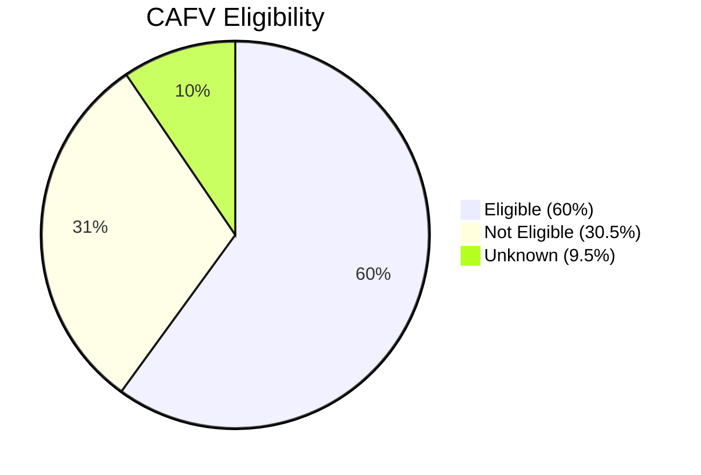

  

## 🚗 Electric Vehicle Population Analysis: Washington State

---

### 🔍 Analysis Overview
This project analyzes Washington State's electric vehicle (EV) registration data to understand market trends, technology adoption, and policy impacts. Using Python for data processing and visualization, key insights about EV distribution, brand performance, and eligibility for clean energy incentives are extracted.

---

### 📂 Dataset Description
**Source**: Washington State Department of Licensing (DOL)  
**Content**:
- Battery Electric Vehicles (BEVs) and Plug-in Hybrids (PHEVs)
- Registration records through 2023
- Key fields: Make/model, electric range, county, CAFV eligibility
- Size: ~300,000 vehicle records

---

### 🛠️ Analytical Approach
1. **Data Processing** (Python):
   - Cleaned missing values and standardized manufacturer names
   - Calculated range statistics by model year
   - Categorized CAFV eligibility status

2. **Analysis Dimensions**:
   - Geographic distribution by county
   - Market share by manufacturer
   - Technology trends (range improvement)
   - Policy impact analysis

3. **Visualization**:
   - Created bar/line/pie charts using Matplotlib/Seaborn
   - Generated geographic heatmaps

---

### 🔑 Key Findings

#### 1. Market Landscape
- **Tesla dominates** with 58% market share among top brands
- **BEVs outnumber PHEVs** 4:1 (79.2% vs 20.8%)
- **Top counties**: King (62k EVs), Pierce (18k), Snohomish (15k)

#### 2. Technology Trends
- **Average range increased** from 85 miles (2015) to 215 miles (2023)
- **Range leaders**: 
   - Tesla Model S: 405 miles
   - Lucid Air: 400+ miles
   - Chevrolet Bolt: 259 miles

#### 3. Policy Impacts

---

### 📝 Summary
The data highlights Tesla’s market dominance, the preference for BEVs with longer ranges, and the significant role of policy incentives in driving EV adoption. Urban centers are the primary adoption hubs, while technological advancements and policy adjustments will shape future trends. Strategic focus on infrastructure, consumer education, and competitive offerings will be key to sustaining growth in the EV market.

